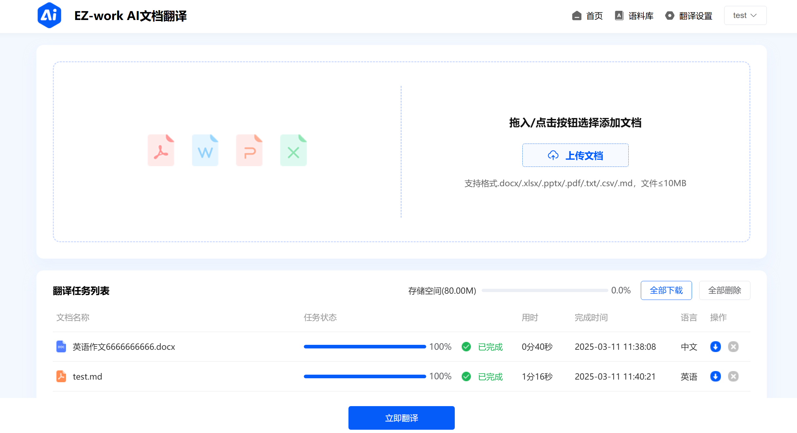
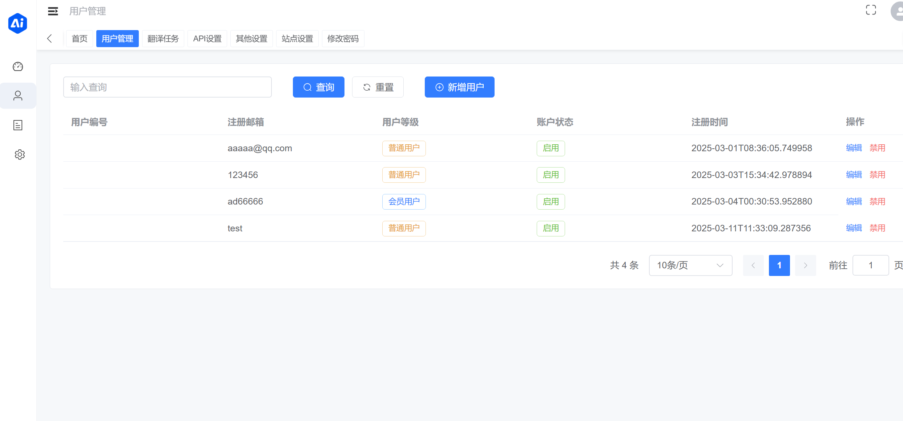
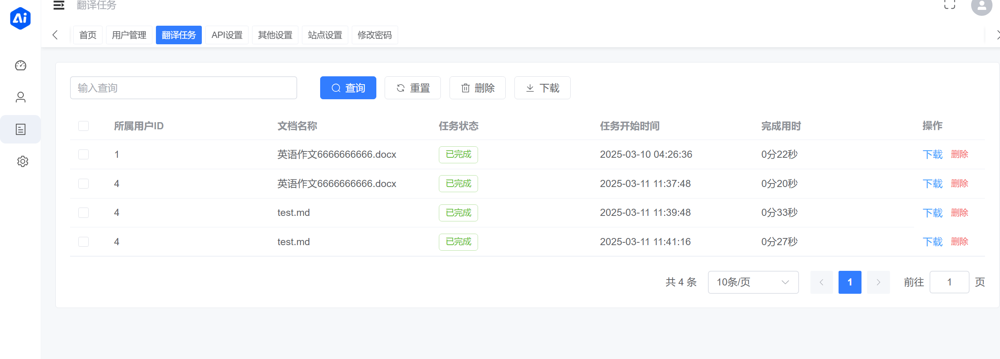

# 📄 DocTranslator - 文档 AI 翻译工具 🚀

**DocTranslator** 文档翻译，支持多种文件格式的翻译，兼容 OpenAI 格式的 API，并支持批量操作和多线程处理。无论是个人用户还是企业团队，DocTranslator 都能帮助你高效完成文档翻译任务！✨

[在线预览](https://demo.doctranslate.top) 
---

[English](README_en.md) 🌍

---

## 🌟 功能特性

- **支持多种文档格式**  
  📑 **txt**、📝 **markdown**、📄 **word**、📊 **csv**、📈 **excel**、📑 **pdf(暂不支持)**、📽️ **ppt** 文档的 AI 翻译。
  
- **扫描 PDF 翻译(暂不支持)**  
  🔍 即使是扫描版的 PDF 文件，也能轻松翻译！

- **兼容 OpenAI 格式的 API**  
  🤖 支持任何符合 OpenAI 格式的端点 API（中转 API），灵活适配多种 AI 模型。

- **批量操作**  
  🚀 支持批量上传和翻译文档，提升工作效率。

- **多线程支持**  
  ⚡ 利用多线程技术，加速文档翻译过程。

- **Docker 部署**  
  🐳 支持 Docker 一键部署，简单易用。

---

## 🛠️ 技术栈

- **前端**：Vue 3 + Vite  
- **后端**：Python + Flask+MySQL/SQLite  
- **AI 翻译**：兼容 OpenAI 格式的 API  
- **部署**：Docker + Nginx  

---

## 效果如图:
### 前端页面演示


### 后端页面演示




## 🚀 本地开发

### 1. 克隆项目

```bash
git clone https://github.com/mingchen666/DocTranslator.git
cd DocTranslator
```

### 2. 配置环境变量

在 `backend/.env` 文件中填写必要的环境变量


### 3. 启动后端

进入后端目录安装依赖：

```bash
cd backend
pip install -r requirements.txt
```

### 4. 启动后端

```bash
python app.py
```

### 5. 启动前端和管理端
> **/dist 文件夹已经是打包好了的，直接部署使用即可，不本地开发可以忽略下面步骤**
>

*前端*

```bash
cd frontend
pnpm install
pnpm dev
```

*管理端*

```bash
cd admin
pnpm install
pnpm dev
```


### 6. 访问项目

- **前端**：http://localhost:1475  
- **管理端**：http://localhost:8081  
- **后端 API**：http://localhost:5000  

---


## 🐳 Docker 部署

### 1. 项目结构

```plaintext
DocTranslator/
├── frontend/          # 前端代码
├── admin/             # 管理员端代码
├── backend/           # 后端代码
├── nginx/             # Nginx 配置
│   └── nginx.conf     # Nginx 配置文件
```

### 2. 创建 Docker 网络

```bash
docker network create my-network
```

### 3. 后端部署

#### 3.1 配置环境变量

确保 `DocTranslator/backend/.env` 文件已正确填写环境变量。

#### 3.2 构建后端镜像

```bash
cd DocTranslator/backend
docker build -t ezwork-api .
```

#### 3.3 运行后端容器

```bash
cd ..
docker run -d \
  --name backend-container \
  --network my-network \
  -p 5000:5000 \
  -v $(pwd)/backend/db:/app/db \
  eggsunsky/doctranslator:latest
```

### 4. 启动 Nginx

```bash
docker run -d \
  --name nginx-container \
  -p 1475:80 \
  -p 8081:8081 \
  -v $(pwd)/nginx/nginx.conf:/etc/nginx/conf.d/default.conf \
  -v $(pwd)/frontend/dist:/usr/share/nginx/html/frontend \
  -v $(pwd)/admin/dist:/usr/share/nginx/html/admin \
  --network my-network \
  nginx:stable-alpine
```

### 5. 访问服务

- **前端**：http://localhost:1475  
- **管理端**：http://localhost:8081  
- **后端 API**：http://localhost:5000  


---

## 📢 交流群
有任何问题想交流，欢迎加入我们的交流群


## 📝 使用指南

1. **上传文档**：在前端页面选择需要翻译的文档并上传。
2. **选择翻译语言**：设置目标语言并开始翻译。
3. **查看结果**：翻译完成后，下载翻译后的文档。

---

## 🤝 贡献指南

欢迎贡献代码！

---

## 📜 许可

[Apache-2.0 license](LICENSE)。

---

## 💖 赞赏支持

如果 DocTranslator 对你有帮助，欢迎赞赏支持！你的支持是我持续开发的动力！😊  
🎉 **赞赏码**：  

---

## 📞 联系我

如有任何问题或建议，请联系我：  

---

## 📌 说明

本项目基于 [ezwork](https://github.com/EHEWON/ezwork-ai-doc-translation) 进行重构优化，感谢原作者的贡献！🙏
