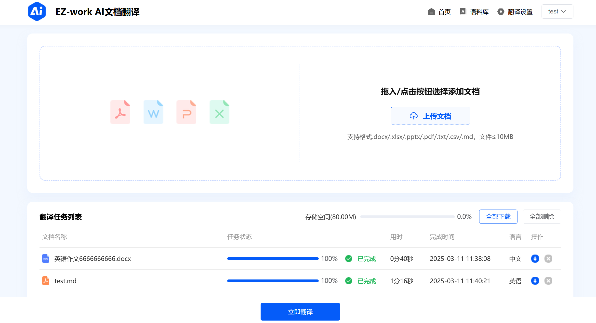
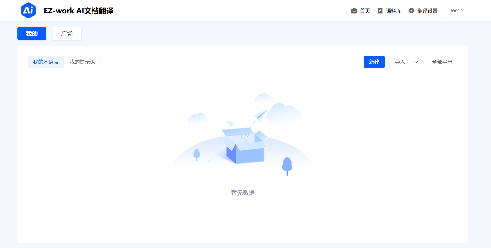
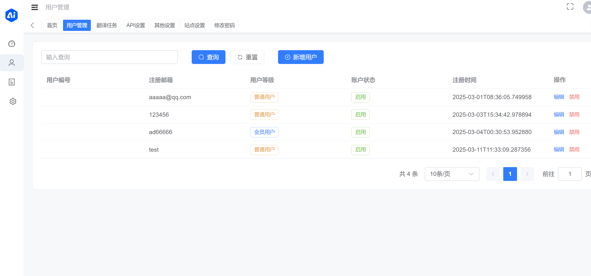
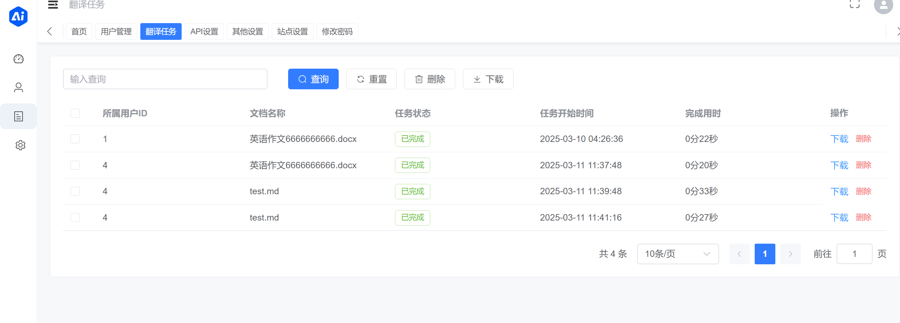
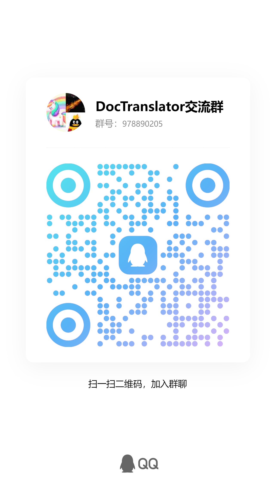

🎉 **DocTranslator Pro is now live!** Welcome to experience its enhanced capabilities!

## ✨ Key Advantages of the Pro Version

- **Intelligent Chunking Strategy**: Better recognizes structures such as paragraphs and lists, avoiding breaks mid-sentence or within table rows, thereby improving translation quality and contextual coherence.  
- **Cost Optimization**: Significantly reduces token consumption through more efficient prompt design and injection strategies, effectively lowering translation costs.  
- **Termbase Support**: Allows users to define custom terminology glossaries to ensure accuracy and consistency in translating specialized terms.  
- **Translation Memory**: Intelligently reuses previous translations to boost efficiency and reduce costs.  
- **AI Model Provider Management**: Supports configuration of multiple large language models including OpenAI, Qwen, and DeepSeek, enabling users to select based on their needs or let the system intelligently route requests.  
- **Batch Processing**: Enables uploading documents and selecting multiple termbases and translation memories for concurrent translation, achieving higher efficiency and accuracy.  
- **Usage Analytics**: Provides management dashboard features such as token consumption statistics.

[](https://pro.doctranslator.cn)  


---

# 📄 DocTranslator - Document AI Translation Tool 🚀

**DocTranslator** is a powerful document AI translation tool that supports translation of multiple file formats, is compatible with OpenAI format APIs, and supports batch operations and multi-threading. Whether you're an individual user or a corporate team, DocTranslator can help you efficiently complete document translation tasks! ✨

---

[[中文]](README.md)

---

## 🌟 Features

- **Supports Multiple Document Formats**  
  📑 **txt**, 📝 **markdown**, 📄 **word**, 📊 **csv**, 📈 **excel**, 📑 **pdf(Non scanned version)**, 📽️ **ppt** AI translation.
  


- **Compatible with OpenAI Format APIs**  
  🤖 Supports any endpoint API (proxy API) that conforms to the OpenAI format, flexibly adapting to various AI models.

- **Batch Operations**  
  🚀 Supports batch upload and translation of documents, improving work efficiency.

- **Multi-threading Support**  
  ⚡ Utilizes multi-threading technology to accelerate document translation.

- **Docker Deployment**  
  🐳 Supports one-click Docker deployment for simplicity and ease of use.

---

## 🛠️ Tech Stack

- **Frontend**: Vue 3 + Vite  
- **Backend**: Python + Flask + MySQL/SQLite  
- **AI Translation**: Compatible with OpenAI format APIs  
- **Deployment**: Docker + Nginx  

---

## Demo Preview  
### Frontend Demo  
  
  

### Backend Demo  
  



## 🚀 Local Development

### 1. Clone the Project

```bash
git clone https://github.com/mingchen666/DocTranslator.git
cd DocTranslator
```

### 2. Configure Environment Variables

Fill in the necessary environment variables in the `backend/.env` file.

### 3. Start the Backend

Navigate to the backend directory and install dependencies:

```bash
cd backend
pip install -r requirements.txt
```

### 4. Run the Backend

```bash
python run.py
```

`python run.py` applies Alembic migrations and idempotent seed data before
starting the development server. Run `python migrate_startup.py` to migrate
without starting the server. Back up production databases before upgrading.

### 5. Start the Frontend and Admin Panel
> **The /dist folder is already built and ready for deployment. If not developing locally, you can skip the following steps.**

*Frontend*

```bash
cd frontend
pnpm install
pnpm dev
```

*Admin Panel*

```bash
cd admin
pnpm install
pnpm dev
```

### 6. Access the Project

- **Frontend**: http://localhost:1475  
- **Admin Panel**: http://localhost:8081  
- **Backend API**: http://localhost:5000  

---

## Linux deployment (recommended)

We recommend Docker Engine on Linux.

### Prepare once

```bash
git clone https://github.com/mingchen666/DocTranslator.git
cd DocTranslator
cp backend/.env.example backend/.env
```

Set `FLASK_ENV=production` and replace the example `PROD_DATABASE_URL`,
`SECRET_KEY`, and `JWT_SECRET_KEY` values in `backend/.env`.

### One-command deployment

```bash
bash deploy.sh
```

The script validates deployment configuration, builds `backend/Dockerfile`,
runs database migrations, and starts the API, Nginx, and the configured queue
workers. The default `TRANSLATION_QUEUE_BACKEND=database` starts the database
worker; `celery` starts Redis plus separate document and PDF workers.

### One-command update

```bash
bash update.sh
```

The update script requires a clean working tree, accepts only a fast-forward
update from `main`, then invokes the same deployment flow to rebuild the
backend image. The committed `frontend/dist` and `admin/dist` directories are
served directly, so the host does not need Node.js or a frontend build.

<details>
<summary>Windows, object storage, and other advanced options</summary>

<br>

### Windows deployment

`deploy.sh` and `update.sh` target Bash on Linux/macOS. Windows users can use
PowerShell with Docker Desktop in Linux containers mode from the project root:

```powershell
# First deployment or the default database queue mode
docker compose up -d --build --force-recreate

# Update. The deployment proceeds only when the pull succeeds.
git pull --ff-only; if ($LASTEXITCODE -eq 0) { docker compose up -d --build --force-recreate } else { exit $LASTEXITCODE }
```

This also builds the backend image and mounts the committed `frontend/dist`
and `admin/dist` directories. For Celery, use
`docker compose --profile celery up -d --build --force-recreate`.

### Translation result object storage

Results remain under `/app/storage` by default. To store newly completed
results in Alibaba Cloud OSS, configure `backend/.env`:

```env
RESULT_STORAGE_BACKEND=oss
OSS_ENDPOINT=https://oss-cn-hangzhou.aliyuncs.com
OSS_BUCKET=your-private-bucket
OSS_ACCESS_KEY_ID=your-access-key-id
OSS_ACCESS_KEY_SECRET=your-access-key-secret
OSS_PREFIX=translations/
```

Use a private bucket and a least-privilege RAM user restricted to read, write,
and delete under `OSS_PREFIX`. The API and every worker must use the same
configuration and have network access to the endpoint. Existing local results
are not migrated, and `/app/storage` remains required for source files,
temporary files, and historical results. Downloads are streamed by the backend,
so bucket CORS is not required. Review OSS request and traffic costs and use a
lifecycle policy that does not expire still-downloadable results.

</details>

## Other projects

- [Reviva](https://github.com/mingchen666/Reviva) - AI learning workspace

---

## 💖 Support

If DocTranslator has been helpful to you, consider supporting the project! Your support keeps me motivated to continue developing! 😊  
🎉 **Support Code**:   

---

## 📢 Join Our Community  
If you have any questions or would like to discuss, feel free to join our QQ group!  



## 📝 User Guide

1. **Upload Documents**: Select the documents you want to translate on the frontend page and upload them.
2. **Select Translation Language**: Set the target language and start the translation.
3. **View Results**: Download the translated documents once the translation is complete.

---

## 🤝 Contribution Guide

We welcome contributions!

---

## 📜 License

[Apache-2.0 license](LICENSE).

---


## 📞 Contact Me

For any questions or suggestions, feel free to reach out:  

---

## 📌 Note

This project is a refactored and optimized version based on [ezwork](https://github.com/EHEWON/ezwork-ai-doc-translation). Thanks to the original author for their contribution! 🙏

## 🙏 Thanks

  [BabelDOC](https://github.com/funstory-ai/BabelDOC)


[](https://star-history.com/#mingchen666/DocTranslator)
